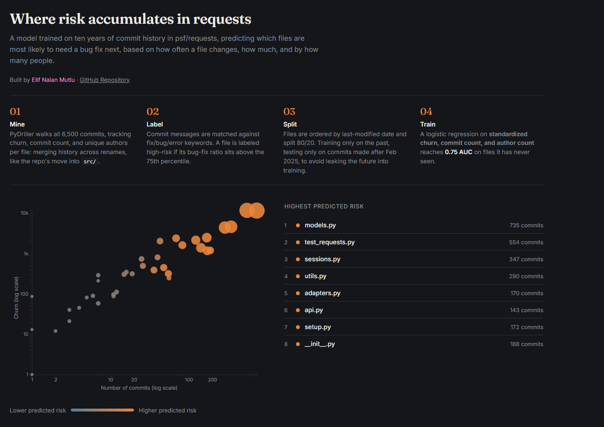

# Code Health Index
### ML-powered repository risk dashboard

Predicts which files in a Git repository are most likely to need a bug fix next, based on a file's commit history: how often it changes, how much, and by how many people. Built and demonstrated against `psf/requests`.

## How it works

**1. Mine.** PyDriller walks every commit in the repository's history, tracking per-file churn (lines added + deleted), commit count, unique authors, and last-modified date.

**2. Handle renames.** Files that get moved or renamed (e.g., `requests/models.py` → `src/requests/models.py`) would otherwise split one file's history into two disconnected entries. Rename commits are detected explicitly, and the old path's accumulated stats are merged into the new path before continuing.

**3. Label bug-fix commits.** Commit messages are matched against a regex covering common bug-fix language (fix, bug, error, crash, closes #123, etc.), a standard, if imperfect, proxy used in software-repository-mining research.

**4. Compute a risk label.** Rather than labeling any file that ever had a single bug-fix commit as "risky" (which would conflate one trivial typo fix with chronic instability), each file's *ratio* of bug-fix commits to total commits is computed, and files above the 75th percentile of that ratio are labeled high-risk.

**5. Time-based train/test split.** Files are sorted by last-modified date; the model trains only on the older 80% and is evaluated only on the newer 20%, so no future information leaks into training.

**6. Train.** A logistic regression on standardized churn, commit count, and author count. Features are scaled before training since they span very different ranges (churn in the thousands, authors typically under 50).

**7. Serve and visualize.** The trained model and scaler are saved and loaded by a FastAPI backend, which scores every currently-existing Python file and serves the results as JSON. A D3.js frontend visualizes the scores.

## Result

**0.75 AUC** on a held-out, chronologically later test set of the repository's Python files.

## Limitations

- **223 files after filtering to `.py` files**, and a ~45-file test set, small enough that the AUC should be read as a proof of concept, not a statistically robust benchmark.
- **Cyclomatic complexity was explored and dropped.** Both `psf/requests` and `psf/black` have undergone a `src/`-layout migration at some point in their history, which meant the majority of historically active Python files no longer exist at their current path, making current-state complexity uncomputable for most of the dataset. Churn, commit frequency, and author count proved to be workable signals on their own.
- **Bug-fix labeling is keyword-based**, not semantic. A fix described without words like "fix" or "bug" (e.g., "correct the encoding issue") won't be captured. A fine-tuned or zero-shot text classifier would likely catch more real fixes, at meaningfully higher implementation cost.
- **Thresholds (75th percentile, 80/20 split) are tuned to this repository's data distribution** and would need to be recomputed, not assumed, for a different repository.

## Tech stack

Python · PyDriller · pandas · scikit-learn · FastAPI · D3.js

## Running it locally

```bash
git clone https://github.com/elifnalan/CodeHealth-Index.git
cd CodeHealth-Index
python -m venv venv
venv\Scripts\Activate.ps1        # Windows
pip install -r requirements.txt

git clone https://github.com/psf/requests.git

cd src
python mine_repo.py     # mines requests/, outputs raw_metrics.csv
python train_model.py   # labels, splits, trains, saves risk_model.pkl + scaler.pkl
uvicorn api:app --reload

# then open src/index.html directly in a browser
```

## Screenshot

